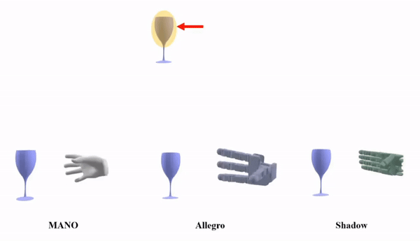

# GraspXL: Generating Grasping Motions for Diverse Objects at Scale

<p align="center">
  <a href="https://arxiv.org/pdf/2403.19649.pdf">
    
  </a>
  <a href="https://eth-ait.github.io/graspxl/">
    
  </a>
  <a href="https://youtu.be/0-dRbxmX2PI">
    
  </a>
  <a href="https://huggingface.co/datasets/ethHuiZhang/GraspXL">
    
  </a>
  <a href="https://github.com/zdchan/GraspXL">
    
  </a>
  <a href="https://github.com/zdchan/GraspXL_visualization">
    
  </a>
</p>

<p align="center">
    
</p>

This is a repository for the visualization of GraspXL Dataset. The repository is based on [arctic-digit](https://github.com/zc-alexfan/arctic-digit), which is used for the visualization of [ARCTIC](https://arctic.is.tue.mpg.de/) dataset.

Our dataset contains diverse grasping motions of 500k+ objects with different dexterous hands:

<p align="center">
    
</p>


<p align="center">
    
</p>

### Getting started

Clone the GraspXL_visualization repository:

```
$ git clone https://github.com/zdchan/GraspXL_visualization.git
$ cd GraspXL_visualization
```

Install the dependencies listed in [environment.yaml](./environment.yaml)

```
$ conda env create -f environment.yaml
$ conda activate graspxl_viewer
```

Download MANO pickle data-structures

- Visit [MANO website](http://mano.is.tue.mpg.de/)
- Create an account by clicking *Sign Up* and provide your information
- Download Models and Code (the downloaded file should have the format `mano_v*_*.zip`). Note that all code and data from this download falls under the [MANO license](http://mano.is.tue.mpg.de/license).
- unzip and copy the contents in `mano_v*_*/models/` to the `data/body_models/mano` folder
- Your `data/body_models/mano` folder structure should look like this:

```
data/body_models/mano
   ├── info.txt
   ├── LICENSE.txt
   ├── MANO_LEFT.pkl
   ├── MANO_RIGHT.pkl
   ├── SMPLH_female.pkl
   └── SMPLH_male.pkl
```
You can now run the grasping visualization scripts for MANO, Allegro, or Shadow Hand in the [./scripts](./scripts) folder. For example, if you want to visualize a MANO grasping sequence, run
```
$ python ./scripts/visualizer_mano.py
```
We use a wine glass as an example. If you want to visualize another object or another sequence, put the object mesh (.obj file) in [./data/GraspXL/object_mesh/](./data/GraspXL/object_mesh/) and the sequence in [./data/GraspXL/recorded/](./data/GraspXL/recorded/), and run
```
$ python ./scripts/visualizer_mano.py --seq_name <sequence name> --obj_name <object name>
```

The repository also provides visualizers for the new tabletop setting of MANO, Allegro, and Sharpa hands. The tabletop scripts use the GraspXL tabletop data layout:

```
data/GraspXL/recorded/<hand_model>_tabletop/<object_dict>/<object_name>/<hand_model>_<num_id>.npy
data/GraspXL/object_mesh/<object_dict>/<object_name>/<object_name>.obj
```

To visualize a random tabletop sequence, run one of:

```
$ python ./scripts/visualizer_mano_table_top.py
$ python ./scripts/visualizer_allegro_table_top.py
$ python ./scripts/visualizer_sharpa_table_top.py
```

To visualize a specific tabletop sequence, specify the collection, object dictionary, object name, and sequence id:

```
$ python ./scripts/visualizer_mano_table_top.py --collection mano_tabletop --object_dict large --object_name <object name> --num_id <sequence id>
```

Use `--headless` to render without opening the interactive viewer, and use `--no_table` to disable the 1m x 1m x 0.05m tabletop mesh.


### Citation

```bibtex
@inProceedings{zhang2024graspxl,
  title={{GraspXL}: Generating Grasping Motions for Diverse Objects at Scale},
  author={Zhang, Hui and Christen, Sammy and Fan, Zicong and Hilliges, Otmar and Song, Jie},
  booktitle={European Conference on Computer Vision (ECCV)},
  year={2024}
}
```

Our tabletop setting uses part of the method from [RobustDexGrasp](https://zdchan.github.io/Robust_DexGrasp/). If you find this setting useful, please consider citing:

```bibtex
@inproceedings{zhang2025RobustDexGrasp,
  title={{RobustDexGrasp}: Robust Dexterous Grasping of General Objects},
  author={Zhang, Hui and Wu, Zijian and Huang, Linyi and Christen, Sammy and Song, Jie},
  booktitle={Conference on Robot Learning (CoRL)},
  year={2025}
}
```

Our paper benefits a lot from [aitviewer](https://github.com/eth-ait/aitviewer). If you find our viewer useful, to appreciate their hard work, consider citing:

```bibtex
@software{kaufmann_vechev_aitviewer_2022,
  author = {Kaufmann, Manuel and Vechev, Velko and Mylonopoulos, Dario},
  doi = {10.5281/zenodo.1234},
  month = {7},
  title = {{aitviewer}},
  url = {https://github.com/eth-ait/aitviewer},
  year = {2022}
}
```
